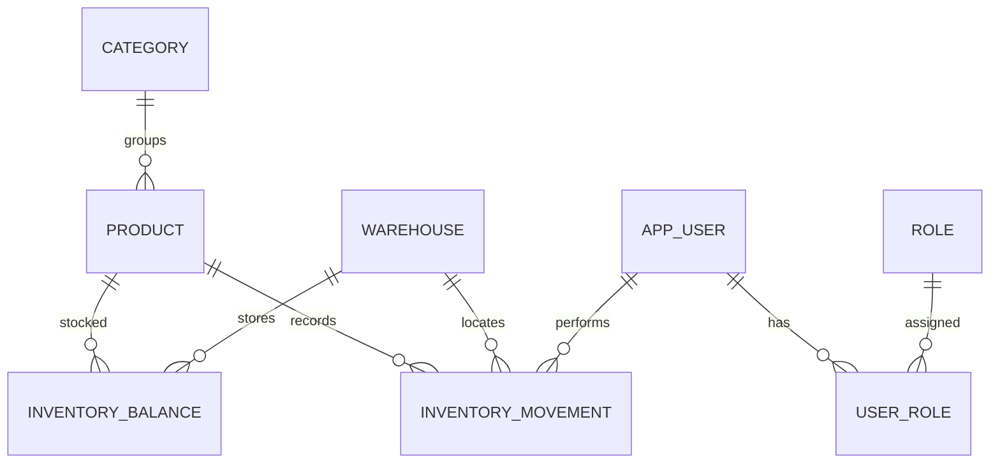

# Entity Relationships

```mermaid
erDiagram
  APP_USER ||--o{ USER_ROLE : has
  ROLE ||--o{ USER_ROLE : assigned
  CATEGORY ||--o{ PRODUCT : groups
  PRODUCT ||--o{ INVENTORY_BALANCE : stocked
  WAREHOUSE ||--o{ INVENTORY_BALANCE : stores
  PRODUCT ||--o{ INVENTORY_MOVEMENT : records
  WAREHOUSE ||--o{ INVENTORY_MOVEMENT : locates
  APP_USER ||--o{ INVENTORY_MOVEMENT : performs
```

This is the target initial model. Reconcile it with migrations before treating it as final.
